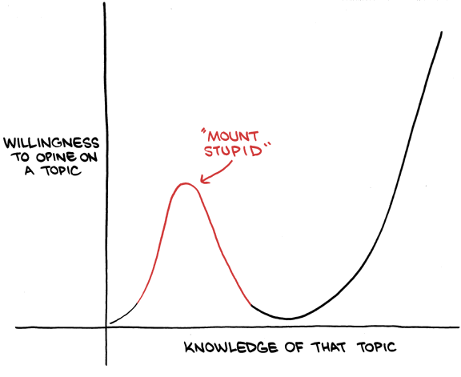

# Coding Basics

Computers are fast. But they can only do *exactly* what you tell them. This means that small errors (such as typos) can cause errors as a computer doesn't know that you meant to type "mean" when you typed "mena".

## My Coding Principles

1)  Organize your files!
2)  See 1
3)  Know what you're doing before you do it
4)  If you don't put comments in your code you will have no idea how it works when you come back to it
5)  Simple is better - unless you have to optimize something, don't spend hours making something slick and fast
6)  Don't waste time solving a future problem (i.e. don't make something generic if you don't have to)
7)  If you have to do something multiple times, write a function or a loop
8)  Check every line of code to make sure it works AND it gives you the expected output. This applies doubly to merging data
9)  When you ignore 8 you will be unhappy.
10) Always be curious about your data. Investigate abnormalities.

If you take away nothing else from this seminar, it's to be curious and organized.

# Debugging

On first glance, it's odd to have a section on errors in code before you write any code. But figuring out how to overcome errors will make your programming experience a lot better.

## What do I do if I have a problem/error?

Short answer: google it.

When you code you will have errors. If you email me every time you get an error both you and I will be very unhappy. I've been coding for over a decade and I still make errors almost every time I code. The main difference between me now and me in 2008 (when I ran my first regressions) is that I'm better at debugging.

So, what do you do: read the error message and then Google it! Look for answers on StackOverlfow. Be suspicious of answers that have sudo in them. That stands for "SuperUser do" and can modify restricted files on your computer. Basically, you risk really screwing up your computer. Sometimes you need to use sudo, but be sure that you really need to.

For most applications, the data analysis you're doing is extremely common. This means that you are *very* unlikely to have a problem nobody else has ever had before.

## Debugging Steps

Here are steps you can use to resolve an error:

1)  Read the error. Like read the whole thing. It may be red and scary looking but the only way you can begin to get a handle on the error is if you read the whole thing.

2)  In the beginning you will get a lot of errors because your data is incompatable with what you want to do with it. For example, you're taking the mean of vector of characters. Or you have the wrong file path. Or you forgot to set stringsasfactors to False.

3)  Copy the generic technical sounding part into Google and search for answers on Stack Overflow. I say "generic" here because Google doesn't care about your own file paths or variable names, so don't copy those.

4)  If Stack Overflow fails 1 of 2 things is happening: 1) your problem is unique and unknown[^1] or 2) You weren't googling the right part of the error. You can try to find answers on other websites like github, reddit, or someone's personal site.

[^1]: If this is the case, you're likely in for a bad time if you need to solve this error

...

Last) Read the R help files. In a normal list this would be 5, but I view these as a last resort, especially when you're learning as they can be dense and often difficult to read.

# How do I x in R?

1) Use cheat sheets.  They're useful - use them. <https://www.rstudio.com/resources/cheatsheets/>

2)  Look for vignettes - these are R documents that show how packages work

-   e.g., <https://cran.r-project.org/web/packages/dplyr/vignettes/dplyr.html>

3)  Use the code from the vignette on the fake data
4)  With a pencil and paper, compare the variables from the fake data to your data

# Workflow

R is part of your data analysis workflow. It's a matter of personal taste (e.g., me using R Studio). Try not to hardwire your workflow into your product (e.g your analysis). This means you should keep file names out of your product.

# Links 

The next section is in bold.

[0 - Project Home](https://sdr1.github.io/R-Intro-Seminar)

[1 - Installing R and R Studio](https://sdr1.github.io/R-Intro-Seminar/1-r-intro-seminar.html)

[2 - Coding Principles and Debugging ](https://sdr1.github.io/R-Intro-Seminar/2-intro-to-coding-debugging.html)

[**3 - R Studio Intro**](https://sdr1.github.io/R-Intro-Seminar/3-intro-to-r-studio.html)

[4 - Basic Coding](https://sdr1.github.io/R-Intro-Seminar/4-basic-coding.html)
