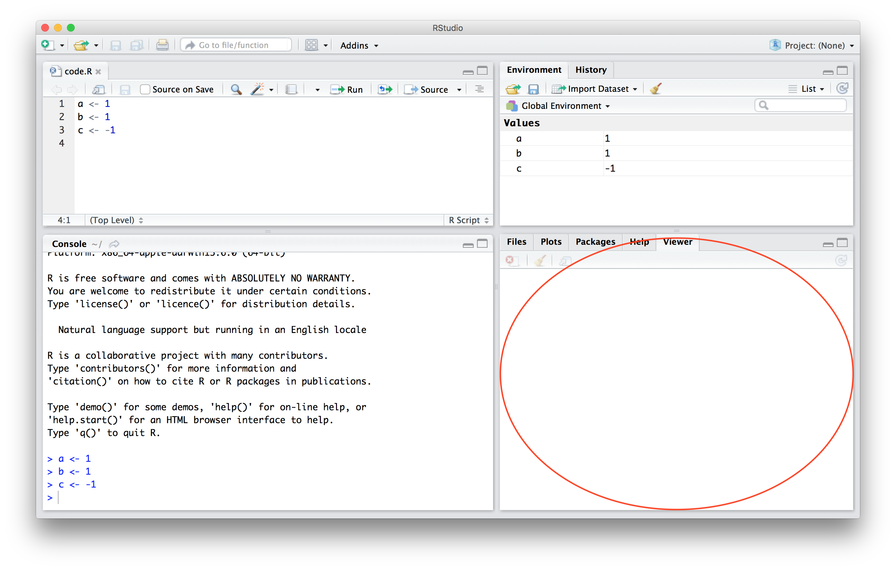
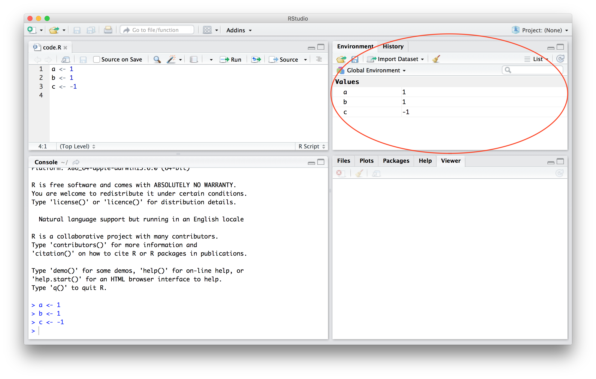

# An Intro to R Studio

### R Environment

This is what your home window likely (there are always new versions of R studio) looks like

### Source Editor

Write and Run your code here. The way to do it is: 1) Highlight the code you wish to run 2) On a mac, press **command** then **enter** 3) Results will appear in the command window

### Console

This is where the non-graph output of your code above goes.

DON'T WRITE CODE HERE. If you do the following is likely to happen.

1)  You get a result that you want
2)  You won't be able to replicate it because you coded the whole thing on the fly
3)  You'll search through the history tab (top right) for a long time

### Files/Plots/Packages/Help/Viewer

This is where you see plots, what packages you have installed, the help files, and the viewer tab.

The "[v]iewer pane can only be used for local web content" such as shiny apps. See e.g. <https://support.rstudio.com/hc/en-us/articles/202133558-Extending-the-RStudio-IDE-with-the-Viewer-Pane>

If you type command + shift + F4 you can use the viewer pane for RMD/Shiny documents

### Workspace Browser

You'll usually have:

Environment - which datasets and functions you've loaded

History - the last commands you typed

Connections - links to sql files 

## How to Organize Your Files

This crap again? YES!

Here's the system I sometimes use. Create a folder for each project. Within each folder have the following subfolders:

1)  scripts (for R/Python/C++ scripts)

2)  data

3)  output

4)  writing

5)  unsorted

Each folder should have a read me - a little document that says what's in the folder. Are these annoying to create? Yes. Are they super useful if you take a break from a project? Definitely yes.

## Why is this intro so long?

All these lessons were hard learned and my goal is for you to not have to learn them the hard way.

I.e. I break the file organization rule all the time. And I have 4 folders for some projects.

## File and variable name conventions

Adopt conventions that you use throughout. Make the names descriptive and give them a number so you know the order in which to execute them. For files with long names:

1)  1-this-is-an-easy-file-name-to-replicate.R

2)  2_underscores_Are_Capital_Letters_annoying_so_dont_use_them.R

3)  Within R have a variable name convention. Since you can't use dashes (-) in file names, either use underscores or periods. If you must have a variable that begins with a number, you will always have to encase it in \`\` (aka an acute/backtick, left quote, or an open quote) marks

# Links
[1 - Installing R and R Studio](https://sdr1.github.io/R-Intro-Seminar/1-r-intro-seminar.html)

[2 - Coding Principles and Debugging ](https://sdr1.github.io/R-Intro-Seminar/2-intro-to-coding-debugging.html)

[3 - R Studio Intro](https://sdr1.github.io/R-Intro-Seminar/3-intro-to-r-studio.html)

[4 - Basic Coding](https://sdr1.github.io/R-Intro-Seminar/4-basic-coding.html)
