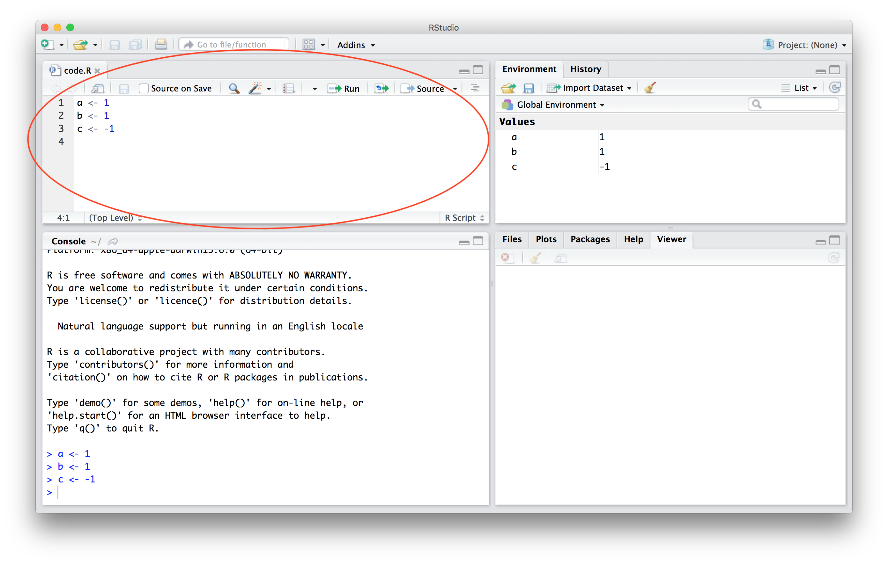
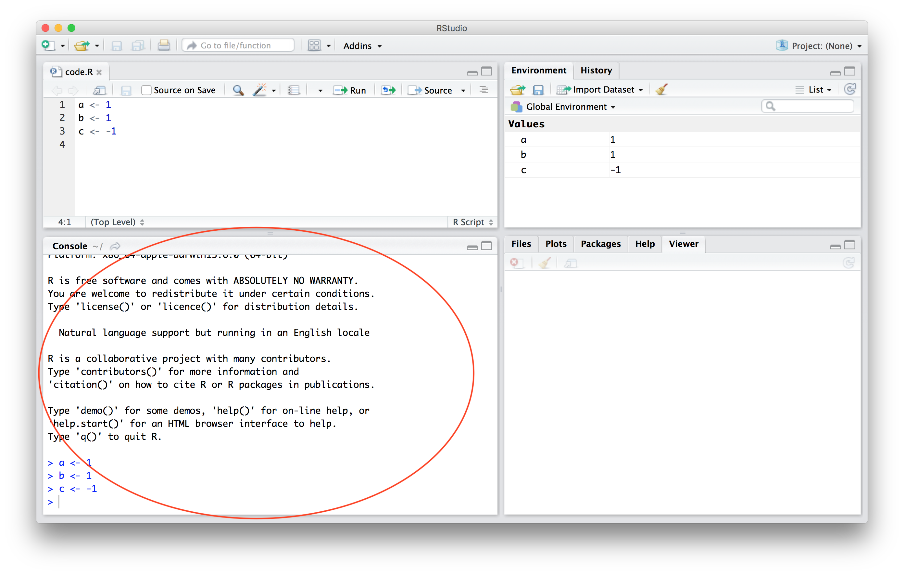
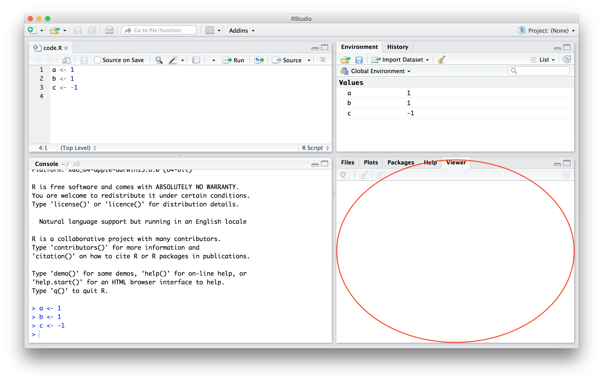
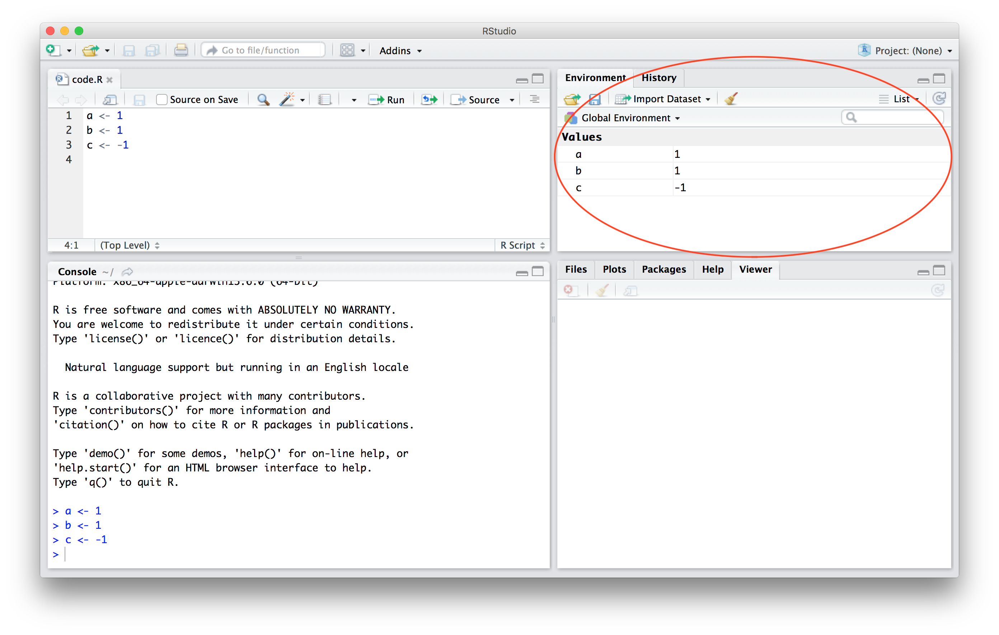
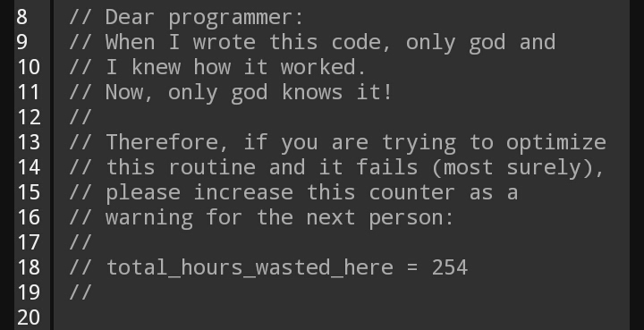
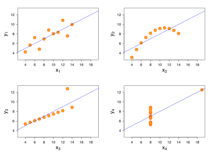

# Coding Basics

Computers are fast. But they can only do *exactly* what you tell them. This means that small errors (such as typos) can cause errors as a computer doesn't know that you meant to type "mean" when you typed "mena".

## My Coding Principles

1)  Organize your files!
2)  See 1
3)  Know what you're doing before you do it
4)  If you don't put comments in your code you will have no idea how it works when you come back to it
5)  Simple is better - unless you have to optimize something, don't spend hours making something slick and fast
6)  Don't waste time solving a future problem (i.e. don't make something generic if you don't have to)
7)  If you have to do something multiple times, write a function or a loop
8)  Check every line of code to make sure it works AND it gives you the expected output. This applies doubly to merging data
9)  When you ignore 8 you will be unhappy.
10) Always be curious about your data. Investigate abnormalities.

If you take away nothing else from this seminar, it's to be curious and organized.


# Debugging

On first glance, it's odd to have a section on errors in code before you write any code. But figuring out how to overcome errors will make your programming experience a lot better.

## What do I do if I have a problem/error?

Short answer: google it.

When you code you will have errors. If you email me every time you get an error both you and I will be very unhappy. I've been coding for over a decade and I still make errors almost every time I code. The main difference between me now and me in 2008 (when I ran my first regressions) is that I'm better at debugging.

So, what do you do: read the error message and then Google it! Look for answers on StackOverlfow. Be suspicious of answers that have sudo in them. That stands for "SuperUser do" and can modify restricted files on your computer. Basically, you risk really screwing up your computer. Sometimes you need to use sudo, but be sure that you really need to.

For most applications, the data analysis you're doing is extremely common. This means that you are *very* unlikely to have a problem nobody else has ever had before.

## Debugging Steps

Here are steps you can use to resolve an error:

1)  Read the error. Like read the whole thing. It may be red and scary looking but the only way you can begin to get a handle on the error is if you read the whole thing.

2)  In the beginning you will get a lot of errors because your data is incompatable with what you want to do with it. For example, you're taking the mean of vector of characters. Or you have the wrong file path. Or you forgot to set stringsasfactors to False.

3)  Copy the generic technical sounding part into Google and search for answers on Stack Overflow. I say "generic" here because Google doesn't care about your own file paths or variable names, so don't copy those.

4)  If Stack Overflow fails 1 of 2 things is happening: 1) your problem is unique and unknown[^1] or 2) You weren't googling the right part of the error. You can try to find answers on other websites like github, reddit, or someone's personal site.

[^1]: If this is the case, you're likely in for a bad time if you need to solve this error

...

Last) Read the R help files. In a normal list this would be 5, but I view these as a last resort, especially when you're learning as they can be dense and often difficult to read.

# How do I x in R?


1) Use cheat sheets.  They're useful - use them. <https://www.rstudio.com/resources/cheatsheets/>

2)  Look for vignettes - these are R documents that show how packages work

-   e.g., <https://cran.r-project.org/web/packages/dplyr/vignettes/dplyr.html>

3)  Use the code from the vignette on the fake data
4)  With a pencil and paper, compare the variables from the fake data to your data


# Other Guides

There are a million guides to R/stats Here are some of my favorites:

-   For another general intro to R by Devin Judge-Lord (an awesome political scientist) <https://github.com/judgelord/PS811>
-   <https://bookdown.org/jgscott/DSGI/>
-   <https://rafalab.github.io/dsbook/getting-started.html>
-   <https://psu-psychology.github.io/psy-525-reproducible-research-2020/how_to/make-website-with-rstudio.html>
-   <https://egap.org/resource/10-things-to-know-about-reading-a-regression-table/>\
-   <https://stats.idre.ucla.edu/stata/output/regression-analysis/>
-   *Mastering Metrics* and *Mostly Harmless Econometrics* by Angrist and Pische
    -   The "Mostly" in "Mostly Harmless" is a lie but it's an amazing book

# Workflow

R is part of your data analysis workflow. It's a matter of personal taste (e.g., me using R Studio). Try not to hardwire your workflow into your product (e.g your analysis). This means you should keep file names out of your product.

# An Intro to R Studio

### R Environment

This is what your home window likely (there are always new versions of R studio) looks like


### Source Editor



Write and Run your code here. The way to do it is: 1) Highlight the code you wish to run 2) On a mac, press **command** then **enter** 3) Results will appear in the command window

### Console



This is where the non-graph output of your code above goes.

DON'T WRITE CODE HERE. If you do the following is likely to happen.

1)  You get a result that you want
2)  You won't be able to replicate it because you coded the whole thing on the fly
3)  You'll search through the history tab (top right) for a long time

### Files/Plots/Packages/Help/Viewer



This is where you see plots, what packages you have installed, the help files, and the viewer tab.

The "[v]iewer pane can only be used for local web content" such as shiny apps. See e.g. <https://support.rstudio.com/hc/en-us/articles/202133558-Extending-the-RStudio-IDE-with-the-Viewer-Pane>

If you type command + shift + F4 you can use the viewer pane for RMD/Shiny documents

### Workspace Browser

You'll usually have:

Environment - which datasets and functions you've loaded

History - the last commands you typed

Connections - links to sql files 



## How to Organize Your Files

This crap again? YES!

Here's the system I sometimes use. Create a folder for each project. Within each folder have the following subfolders:

1)  scripts (for R/Python/C++ scripts)

2)  data

3)  output

4)  writing

5)  unsorted

Each folder should have a read me - a little document that says what's in the folder. Are these annoying to create? Yes. Are they super useful if you take a break from a project? Definitely yes.

## Why is this intro so long?

All these lessons were hard learned and my goal is for you to not have to learn them the hard way.

I.e. I break the file organization rule all the time. And I have 4 folders for some projects.

## File and variable name conventions

Adopt conventions that you use throughout. Make the names descriptive and give them a number so you know the order in which to execute them. For files with long names:

1)  1-this-is-an-easy-file-name-to-replicate.R

2)  2_underscores_Are_Capital_Letters_annoying_so_dont_use_them.R

3)  Within R have a variable name convention. Since you can't use dashes (-) in file names, either use underscores or periods. If you must have a variable that begins with a number, you will always have to encase it in \`\` (aka an acute/backtick, left quote, or an open quote) marks

# Installing Packages

```{r setup, include=F}
# Comments come after pound signs, the computer won't run this code at all
#' To have comments go over many lines, start the first line with a pound sign and then an apostrophe
#' Like this 

# These lines install packages that you're probably going to use below
knitr::opts_chunk$set(echo = TRUE, #means that code will show
                      cache = FALSE,
                      #cache = TRUE,
                      warning = FALSE,
                      message = FALSE,
                      fig.show="hold",
                      fig.pos= "htbp",
                      fig.path = "figs/",
                      fig.align='center',
                      fig.cap = '   ',
                      fig.retina = 1, #6, #FIXME for publication quality images
                      fig.height = 3,
                      fig.width = 7,
                      out.width = "100%",
                      out.extra = "")

```

A large percentage of the work you do requires packages not included in base R (i.e. what you get when you download R). Note that in order to use the package, you have to call it with library AFTER downloading it.

To install a single package use the following code:

```{r install one package, eval = FALSE}
install.packages('tidyverse', repos = "http://cran.us.r-project.org")
```

To install multiple packages, use the following code:

```{r install multiple packages, eval = FALSE}
requires <- c("tidyverse", # tidyverse includes dplyr and ggplot2
              "ggridges",
              "broom",
              "tidytext",
              "tm",
              "stm",
              "wordcloud",
              "grid",
              "gridExtra",
              "magrittr",
              "foreign",
              "readstata13",
              "tidytext",
              "stm",
              "topicmodels",
              "textfeatures",
              "cleanNLP", ## https://statsmaths.github.io/cleanNLP/
              "maps",
              "sf",
              "rvest",
              "remotes",
              "knitr")

## Install any you don't have
to_install <- c(requires %in% rownames(installed.packages()) == FALSE)

install.packages(setdiff(to_install, rownames(installed.packages())),repos = "http://cran.us.r-project.org")  
```

Note that above the c() is used to combine items. Note that c(a, b) != list(a,b)

## Commenting Code

Always write comments to yourself in your code. If you don't you'll have no clue what you wrote once you abandon the project. You can comment out in two ways in R - \# for single lines and #' for multiple lines.

[^2]

[^2]: This version stolen from <https://www.reddit.com/r/ProgrammerHumor/comments/8pdebc/only_god_and_i_knew/> but this is definitely not the original source.

```{r commenting}
# this is a comment and R won't run it

# ' This is a comment that spans multiple lines and can be extended with just enter
# ' this is a second line

3+3

#' You can also comment out a lot of lines with command - shift - c

```

## Exercise 1

Install the package 'here'

Load the package using library(here)

Use the function i_am("INSERT SCRIPT NAME HERE")

Type "getwd()"

Here's the answer [Exercise 1: Answer]

# A Brief Guide to Data

## What is data?

At the most basic level, data is a piece of information about something. For our purposes, data can be viewed as a numerical representation of some phenomenon. For example, the heights of NBA players, the GDP of OPEC countries from 1999-2015, etc...

## What does data look like?

This is a sample from a dataset called mtcars that is included in R.  It was "extracted from the 1974 Motor Trend US magazine, and comprises fuel consumption and 10 aspects of automobile design and performance for 32 automobiles (1973--74 models)."<https://www.rdocumentation.org/packages/datasets/versions/3.6.2/topics/mtcars>

```{r}
library(tidyverse)
library(kableExtra)

knitr::kable(mtcars, digits = 2) %>%
  kable_styling(bootstrap_options = c("striped", "hover"))  %>%
  scroll_box(width = "900px", height = "200px")
```

## Where do I find it?

Mostly online. Sometimes you'll create it yourself (like in a Bio/Chem lab) but, in the social sciences unless you're running experiments you're likely finding the majority of your data online.

**Is data ready to use out of the box?**

Hahahaha. No. Almost never.

**Even if it's from a published paper?**

Yes.

## How is data stored?

There are a variety of formats - the most common are CSV (comma separated values), xls/xlsx (Excel spreadsheets), .dta (STATA), .tab (tab delimited), and sqlite/sql (databases). You always want to pay attention to the file ending as different endings require different strategies to load the data. The most basic forms, spreadsheets (csv/xls/xlsx) can be opened in a program like Excel/Google Sheets/Numbers.

## Where on your computer is data stored?

Short answer: likely in your Downloads folder or on your Desktop. Move it to the same folder as your current project.

Longer answer:

All files in your computer have something called a filepath. This object - e.g., "/Users/stevenrashin/Documents/GitHub/R-Intro-Seminar/r-intro-seminar.RMD" - tells your computer exactly where a file is located (otherwise it can't find the file). In this case, the source code for this seminar is under the user name stevenrashin in a folder called Documents in a folder called Github in a folder called R-Intro-Seminar with the file name r-intro-seminar.RMD.

To find the file path, for a mac, right click (or two fingered click on a track pad) then hold down the option key and click the option "copy [filename] as Pathname". On a PC it's "copy as path".

Per my rant about organization above you SHOULD put the data in a folder called Data below another folder called Project-Name. If all you're doing is a stats assignment with one dataset, having the data in the same folder as your project is ok.

## What is the first thing I do when I download data?

Read the codebook. Here is one codebook for a dataset that comes with R: <https://stat.ethz.ch/R-manual/R-devel/library/datasets/html/mtcars.html>

## What if there is no codebook?

That happens sometimes, it's annoying. Information should be stored in the variables themselves or in the paper you got the data from.

## Unit of Analysis

The second thing you do after reading the codebook is to figure out what each row of the data represents. Is is a person? Country? Country-year? The subject of each row is the "unit of analysis" i.e. what you're analyzing.

## A Few Basic R Commands for dealing with Data

**c(A,B,C)** - allows you to concatenate A B and C

```{r concatenate}
c(4, 6, 7, TRUE, "X", NA)
```

**saved_object \<- not_saved_object** - save object. Note that "Object names cannot start with a digit and cannot contain certain other characters such as a comma or a space. You will be wise to adopt a convention for demarcating words in names.(<https://stat545.com/r-basics.html>)" - Note that the more descriptive you make names, the more you'll be able to understand what you did if you come back to the code after a period of time

```{r save}
this_is_an_object <- c(4, 6, 7, TRUE, "X", NA)
```

**&** - and

```{r and}
3 & 4 > 2

3 & 4 > 4
```

**\|** - or

```{r or}
3 | 4 > 2

3 | 4 >= 4
```

**%in%** - in. As in is x in c(a, b, x)

```{r}

3 %in% c(3, 4, 5)

3 %in% list(4, 5, 6)

```

**ifelse(test = , yes = , no = )** - allows you to create variables based on other variables.

```{r}
example_data <- c(2, 3, 6, 234)

ifelse(test = example_data > 10, yes = 1, no = 0)
```

**'text' or "text"** - way to put text

```{r}
"Remove the quotes from this and see if it causes an error"
```

**Exercise**

Google: "R" "Unexpected Symbol"

Put both "R" and "Unexpected Symbol" in quotes. If you don't put "R" in quotes you may get answers for other programming languages that doesn't work in R.

Go to the first result. It's likely <https://stackoverflow.com/questions/25889234/error-unexpected-symbol-input-string-constant-numeric-constant-special-in-my-co>

Read the question and then look at the answer

**\#** - comment out something in code

opt (mac) or alt (pc) + Shift + K brings up keyboard shortcuts

**%!in%** - Not in.

```{r not in}
'%!in%' <- Negate('%in%')

# Here's an example

3 %!in% c(4, 5, 6)

3 %!in% c(3, 4, "a", 6)
```

**\$** - allows you to select a variable. Note that I'm going to introduce the tidyverse next which uses select(var_name) to select variables but this will be useful.

```{r selector}
mtcars$mpg
```

## Data types

R has several different data types. **Know how your data is stored!** You should care about this because you can't take averages of non-numeric data. So make sure your data is stored as a number or, if not, you convert it to one.

You'll occasionally get an error saying that you need an "atomic" vector. When we call a vector atomic, we mean that the vector only holds data of a single data type. Below are examples of atomic character vectors, numeric vectors, integer vectors, etc.

-   character: "this is a letter", "swc"
-   numeric/double/integer: 10, 5.5 [^3]
-   integer: 2L (the L tells R to store this as an integer)
-   logical: TRUE, FALSE
-   complex: 1+4i (complex numbers with real and imaginary parts). It's unlikely you'll use this.
-   raw: raw bytes / binary. Don't worry about this type. See e.g., class(intToBits(34))

[^3]: See <https://faculty.nps.edu/sebuttre/home/R/data.html> for more detail

See <https://swcarpentry.github.io/r-novice-inflammation/13-supp-data-structures/#:~:text=R's%20basic%20data%20types%20are,%2C%20data%20frame%2C%20and%20factors.> for more detail.

### Exercise

Why will the following cause an error? To figure it out, recall the steps from [Debugging Steps]

```{r, eval = F}
made_up_data <- 
  data.frame(
    char = c("This is a character", "another", "third", "final"),
    dbl = c(4, 5, 10, 234.5),
    integer = c(4L, 5L, 10L, 40L),
    logical = c(T, F, T, F),
  )
```

The error reads "Error in data.frame(char = c("This is a character", "another", "third",  : 
  argument is missing, with no default".  The portion we care about is "argument is missing, with no default" this is the generic part of the error we can google.

```{r some made up data}
made_up_data <- 
  data.frame(
    id = c("1","2","3","4"),
    char = c("This is a character", "another", "third", "final"),
    dbl = c(4, 5, 10, 234.5),
    integer = c(4L, 5L, 10L, 40L),
    logical = c(T, F, T, F)
  )

# see if data is numeric or not.  If not, will need to convert
lapply(X = made_up_data, FUN = class)

# OR

tibble(made_up_data)
```

How is ID stored?  

## The Tidyverse

This is a group of packages that use a common grammar - i.e. you can do many things using the same components. In general, it's very fast and capable. See <https://www.tidyverse.org/>.

For this seminar we're going to focus (mostly) on the data manipulation package (dplyr) and the graphics package (ggplot). A bigger cheat sheet is here <https://github.com/rstudio/cheatsheets/blob/main/data-transformation.pdf>.

Here are a few basic commands

-   %\>% links commands
-   mutate() adds new variables that are functions of existing variables
-   select() picks variables based on their names.
-   filter() picks cases based on their values.  Use the logical commands (i.e. &, %in%, |, etc from above)
-   summarise() reduces multiple values down to a single summary.
-   arrange() changes the ordering of the rows.
-   group_by() analyze the data by group.

In the following box, I'm going to use a built in dplyr dataset storms that tracks hurricanes. Note that almost all packages contain built in datasets that you can use to test their functions. (We'll cover loading data later in the guide).

```{r tidyverse intro}
library(tidyverse)

# First look at the dataset
storms 

# Then let's select the name, status, month, and wind variables 
# I'm explicitly using dplyr::select here to show you what package this came from
storms %>%
  # select variables
  dplyr::select(name, status, wind, month) %>%
  # only take rows where the wind is greater than 75 mph
  filter(wind >= 75) %>%
  # create a variable for a storm in the first six months of the year
  mutate(
    in_first_six_months_of_year = ifelse(month <= 6, 1, 0)
  ) %>%
  # group by year
  group_by(in_first_six_months_of_year) %>%
  # get the max by group
  summarize(
    max_windspeed = max(wind)
  ) %>%
  # arrange the results 
  arrange(desc(in_first_six_months_of_year))
```

### Exercise

1)  Take the starwars dataset from the dplyr package and find the tallest character by hair color.

2)  What is going on with characters with black hair? Some data is missing so dplyr doesn't know how to interpret a missing value, hence the NA. To get the tallest character without regard for missing data (which you should always be aware of), add the option na.rm = T to max. So max becomes max( , na.rm = T).

3)  What is going on with unknown hair color?

```{r Exercise 3}
library(tidyverse)

# First look at the dataset
starwars

starwars %>%
  group_by(hair_color) %>%
  summarise(tallest = max(height, na.rm = T)) %>%
  arrange(tallest)
```

# Loading Data

Ultimately you will have to load data into R. That's sort of the entire point of R. Data comes in many forms. Loading data, therefore, also takes many forms.

## CSVs

```{r, eval=F}
load_csv <- read.csv(file = "change-this-to-file-name.csv",stringsAsFactors = F)

# Or

load_as_tibble <- readr::read_csv(file = "change-this-to-file-name.csv")
```

## XLSX (Excel)

```{r, eval=F}
library(readxl)

read_old_excel <- readxl::read_xls(path = "change-this-to-file-name.xls", sheet = "Sheet1")

read_new_excel<- readxl::read_xlsx(path = "change-this-to-file-name.xlsx", sheet = "Sheet1")
```

## SQLite

```{r, eval=F}
library(DBI)
library(RSQLite)

## SQlite

# set location
master_location <- "Data/master.sqlite"

# connect
con = dbConnect(SQLite(), dbname=master_location)

# see all tables
alltables = dbListTables(con)

# figure out which table to load
alltables

# The SQLite commands are in the quotes
myQuery_mod <- dbSendQuery(con, "SELECT * FROM change_to_load")

# this loads all rows
load_all_rows <- dbFetch(myQuery_mod, n = -1)

# convert to txt
all_rows_to_tibble <- load_all_rows %>% tibble()
```

## STATA/SPSS

```{r, eval=F}
library(haven)

load_stata <- haven::read_dta(file = "change-this-to-file-name.dta")
load_stata <- haven::read_stata(file = "change-this-to-file-name.dta")
```

## Text Data

See <https://tutorials.quanteda.io/import-data/multiple-files/>. This task is hard to generalize and depends on the type of data you care about. Here's an example that shows how to load a bunch of PDFs from a directory.

```{r, eval=FALSE}
library(readtext)

# read all PDFs from the /pdf/UDHR directory into R
dat_udhr <- readtext(paste0(path_data, "/pdf/UDHR/*.pdf"), 
                      docvarsfrom = "filenames", 
                      docvarnames = c("document", "language"),
                      sep = "_")
```

## JSON

Web data is sometimes stored as JSON - JavaScript Object Notation. If well formatted, it is very easy to load and use. If not, then it can be tedious to get it in the right format. See the example below about loading

```{r, eval=F}
Federal_Register_API <- "https://www.federalregister.gov/api/v1/agencies"

# this doesn't work
rjson::fromJSON(Federal_Register_API)

# this does
jsonlite::fromJSON(Federal_Register_API) %>% tibble()

# tidy json is not easy to use
Federal_Register_API %>% spread_all
```

## Other forms

There are a variety of other forms of data like tab, etc... Just google how to load them.

# Merging Data

Often you will have to combine many datasets for a project to yield something useful. I recommend using the package tidylog (<https://github.com/elbersb/tidylog>) - it's a package that spits out information about what the tidyverse is doing under the hood. It's a lifesaver because it will tell you what merged and what did not. You need to load it **after** the tidyverse otherwise nothing will happen.

Let's look at an example that merges flights out of new york city with new york city weather. Why we're doing this particular merge doesn't matter, perhaps we want to see if delays are more likely in cold weather. Or perhaps we want proof[^4] that Newark is by far the worst airport in the New York/New Jersey/Connecticut area or that American Airlines is specifically out to get my father.

[^4]: I'm not going to define this because it's immaterial to this point.

```{r merging example, warning=TRUE, message=TRUE, comment="", collapse = TRUE}
library(tidylog)

joined <- dplyr::left_join(nycflights13::flights, nycflights13::weather,
    by = c("year", "month", "day", "origin", "hour", "time_hour"))

# Now we see the use of this package!!

# this keeps everything on the left i.e. flights and merges in any matching data on the right
left_joined <- tidylog::left_join(nycflights13::flights, nycflights13::weather,
    by = c("year", "month", "day", "origin", "hour", "time_hour"))

left_joined
# this keeps everything on the right i.e. flights and merges in any matching data on the left

right_joined <- tidylog::right_join(nycflights13::flights, nycflights13::weather,
    by = c("year", "month", "day", "origin", "hour", "time_hour"))

right_joined

not_joined <- tidylog::anti_join(nycflights13::flights, nycflights13::weather,
    by = c("year", "month", "day", "origin", "hour", "time_hour"))

not_joined

not_joined_other_way <- tidylog::anti_join(nycflights13::weather,nycflights13::flights,
    by = c("year", "month", "day", "origin", "hour", "time_hour"))

not_joined_other_way

all_joined <- tidylog::full_join(nycflights13::flights, nycflights13::weather,
    by = c("year", "month", "day", "origin", "hour", "time_hour"))

all_joined
```

**What do we do about the non merged data**

Depends. Sometimes we figure out how to merge it. Sometimes we don't. Depends on the project.

**What if there aren't exact string matches?**

You can either use fuzzy matching (fast but not terribly accurate) or prayer to your favorite divine/earthly entity. Basically, its a BIG problem everyone has and there's no good solution.

I come across this problem often enough I wrote a wrapper for this sort of thing. This one uses the [Jaro-Winkler Distance](https://en.wikipedia.org/wiki/Jaro%E2%80%93Winkler_distance).

```{r, eval=T}
these_packages_for_string_matching <- c("pbmcapply","stringdist","magrittr")

to_install <- c(these_packages_for_string_matching %in% rownames(installed.packages()) == FALSE)

install.packages(setdiff(to_install, rownames(installed.packages())),repos = "http://cran.us.r-project.org")  

library(dplyr)
library(pbmcapply)
library(stringdist)
library(magrittr)

#inputs: two data frames target_df and new_df.  outputs, dataframe with matches
fuzzyMatch <- function (a, b) {
  
  # calculate a jaccard dissimilarity matrix 
  distance <- stringdistmatrix(a,b,method = 'jw', p = 0.1, useBytes = T)
  
  # find the closest match for each
  match <- apply(distance, 1, which.min)
  
  # find how far away these were
  dists <- apply(distance, 1, min)
  
  # return these as a two-column matrix
  return (cbind(match = match,
                distance = dists))
  
}

apply_fuzzy_match <- function(df_a, col_in_a, df_b, col_in_b, max.dist){

  # df_a = Unmatched_Titles
  # col_in_a = "Match_Name"
  # df_b = unique_titles_in_raw_coding
  # col_in_b = "Match_Name"
  # max.dist = 0.2
  
  df_a_var <- c(col_in_a)
  df_b_var <- c(col_in_b)
  
  df_a_column <- df_a %>% dplyr::select(dplyr::all_of(df_a_var)) %>% pull()
  df_b_column <- df_b %>% dplyr::select(dplyr::all_of(df_b_var)) %>% pull()
  
  #apply matching algorithm
  matches <- pbmclapply(X = df_a_column, FUN = function(X, b) fuzzyMatch(X,b), b=df_b_column)
  indx <- sapply(matches, length)
  match_df <- as.data.frame(do.call(rbind,lapply(matches, `length<-`,max(indx))))
  
  #update the data frame
  a_frame <- df_a %>%
    dplyr::select(dplyr::all_of(df_a_var)) 

  b_frame <- df_b %>% 
    dplyr::select(dplyr::all_of(df_b_var)) %>%
    slice(match_df[,"match"]) %>%
    dplyr::bind_cols(match_df[,"match"]) %>%
    rename("Match_Row_In_B" = 2) %>%
    dplyr::bind_cols(match_df[,"distance"]) %>%
    rename("JW_Distance" = 3)
  
  a_frame %<>%
    dplyr::bind_cols(b_frame) %>% 
    filter(JW_Distance <= max.dist )

  names(a_frame) <- c(
    c(paste0("A_",col_in_a)), c(paste0("B_",col_in_b)), "Row_Match_From_DF_B", "JW_Distance"
  )
  
  return(a_frame)
}

example_a <- tibble(
  org = c("Goldman Sachs Inc","bank of america", "Steve's Madeup Company"),
  some_x_var = c(3, 5, 8), 
)

example_b <- tibble(
  org1 = c("Goldman Sachs ","bank of america NA", "Another unrelated company"),
  some__other_x_var = c(3, 5, 2), 
)

apply_fuzzy_match(df_a = example_a, col_in_a = "org", df_b = example_b, col_in_b = "org1",max.dist = 0.1)

```

# Summary Statistics

Once you have data you need to describe it so both you and your audience know what it is. Below are some useful summary statistics.

Why are they useful? You want to see how messy your data is.

n is the number of observations. We care about this because we want to know how much data we're dealing with. If some variables have more information than others, this helps us figure out where the variables are missing.

mean/median are good too.

min/max are good for looking for outliers. One definition of outlier is the third quantile (75th percentile) + 3 times the range from the 25-75th quantiles (for low outliers replace 3rd with first and the plus with a minus)

quantiles give you a sense of how the data is distributed. There are no hard and fast rules about good (or 'bad') distributions of data but, you should look out for things that are strange.

standard deviation is a measure of how a variable is spread. The formula is $\sigma = \sqrt{\sum{(x_i-\mu)^2}/n}$. If your data is all the same number, the standard deviation will be 0 (and you should find new data).

```{r Summary stats}
mtcars %>% 
  summarise(
            n = n(),
            min = min(mpg),
            Q1 = quantile(mpg, 0.25, na.rm = T),
            median = quantile(mpg, 0.5, na.rm = T),
            Q3 = fivenum(mpg)[4],
            Q75 = quantile(mpg, 0.75, na.rm = T),
            Q99 = quantile(mpg, 0.99, na.rm = T),
            max = max(mpg),
            sd = sd(mpg)) %>%
  #' This stuff below just makes the data above displacy nicely for you, its completely unnecessary for most uses.
  kable(digits = 2) %>%
  kable_styling(bootstrap_options = c("striped", "hover"))  %>%
  scroll_box(width = "900px", height = "200px")
```

Skim is a great package for summarizing variables.

```{r code for summarizing multiple variables}
mtcars %>%
  select(mpg, cyl, disp) %>%
  skimr::skim()
```

**Beware**



From <https://en.wikipedia.org/wiki/Anscombe%27s_quartet>

The following has the same mean, median, and variance even though they are from very different data generating processes.

## Summarizing by group

Sometimes you want to summarize data by group. dplyr makes this easy with the group_by() function.

Below, using the nycflights13 - all flights in and out of NYC in 2013 - data, I show you how to get tallies by manufacturer.

```{r}
nycflights13::planes %>%
  group_by(manufacturer) %>%
  tally() %>%
  arrange(desc(n))
```

You can summarize variables by group too. The following example summarizes departure delays and distance flown by airline.

```{r}
nycflights13::flights %>%
  group_by(carrier) %>%
  dplyr::select(dep_delay, distance) %>%
  skimr::skim()
```

But this is a bit messy, and we may want to see the airlines actual names.

```{r}
nycflights13::flights %>%
  dplyr::select(carrier, dep_delay, distance) %>%
  left_join(nycflights13::airlines, by = "carrier") %>%
  dplyr::select(-carrier) %>%
  group_by(name) %>%
  skimr::skim() %>%
  arrange(name) %>%
  # These options just make the data look nice in RMarkdown
  kable(caption = "Example for a table with some descriptives") %>% 
  kable_styling(
    bootstrap_options = "striped", # several design options
    full_width = FALSE, # defaults to TRUE
    position = "center", # where is it positioned?
    fixed_thead = TRUE # whether header is fixed when scrolling through -- only for longer tables
  ) %>% 
  column_spec(1, bold = TRUE, border_right = TRUE) %>% # column specifications can be easily modified
  footnote(general = "You can add some footnotes with certain signs, too.", # this is how you add a footnote
           number = c("Footnote 1; ", "Footnote 2; "),
           alphabet = c("Footnote A; ", "Footnote B; "),
           symbol = c("Footnote Symbol 1; ", "Footnote Symbol 2"),
           general_title = "General: ", number_title = "Type I: ",
           alphabet_title = "Type II: ", symbol_title = "Type III: ",
           footnote_as_chunk = T, title_format = c("italic", "underline")
           )

```

## Exercise

Take a data set, figure out how the variables are stored, and give me the median, mean, standard deviation, and 95th percentile of hlth. hlth is the processed version of health. To see the difference between the two, just swap them out in the exercise below and you'll notice a difference.

Download the data from <http://www.masteringmetrics.com/wp-content/uploads/2021/04/Data.zip>. Load it using haven::read_dta("INSERT FILE PATH HERE")

## Exercise: Answer

```{r Exercise 2}
NHIS <- haven::read_dta("Data/NHIS2009_clean.dta")

# see if data is numeric or not.  If not, will need to convert
lapply(X = NHIS, FUN = class)

NHIS %>%
  summarise(
    mean = mean(hlth),
    median = quantile(hlth, 0.5, na.rm = T),
    Q95 = quantile(hlth, 0.95, na.rm = T),
    sd = sd(hlth)) 
```

# Plotting


Before you plot, figure out why you're doing it. In general we plot:

1 - To figure out what our data looks like 

2 - To explain our findings/data to others

Know which one you're doing first! If it's 1, don't waste an hour getting everything exactly right. Just look for weirdness in the data that you want to investigate. If it's 2, then make sure the plot looks good and is presentable to others.

In R you can do both with ggplot2 and a couple of standard commands. This section will be grossly incomplete given there are books devoted to the subject.

The best way to show how to use ggplot is to work through an example. Suppose we want to plot the hour-by-hour weather at JFK for a year.

There are way too many themes to review here but you can change the themes as much as you want. See e.g., <https://ggplot2-book.org/polishing.html> and <https://towardsdatascience.com/themes-to-spice-up-visualizations-with-ggplot2-3e275038dafa>. Keep in mind that (a) if you're not printing in color you should use some black/white/grey theme like theme_bw().

As a sidenote: since your goal in plotting is to make the data accessible to others, you should consider using themes that are accessible to those who are color blind. This is not a small population! See e.g., <https://www.sciencedirect.com/science/article/pii/S2352304215000215>

Below I'm going to show you 7 plots using the same data.  Some are useful, some aren't. Recognizing which plots are confusing is important.

```{r}
if(c("ggthemes") %!in% installed.packages()){install.packages('ggthemes')}

library(ggthemes)

# Load Data (this one is easy because it's built into R)
nycflights13::weather %>%
  # Filter out EWR and LGA
  filter(origin == "JFK") %>%
  # start plotting commands
  ggplot(aes(x = time_hour, y = temp)) +
  # make it a line plot
  geom_line() +
  # minimal theme
  theme_minimal() +
  #scale_y_continuous(label = scales::comma) +
  xlab("Time") + ylab("Temperature (F)") + 
  ggtitle("Hour by Hour Temp at JFK: 2013") +
  theme(
    # Make title front and center size 14 font
    plot.title = element_text(size=14, face="bold",hjust = 0.5),
    axis.title.x = element_text(size=14, face="bold"),
    axis.title.y = element_text(size=14, face="bold"),
    strip.text.x = element_text(size=10, face="bold"),
    axis.text = element_text(size=10, face="bold"),
    # axis.text.x = element_blank(),
    #panel.border = element_blank(), 
    panel.grid.major = element_blank(),
    #panel.grid.minor = element_blank(),
    legend.position = "none"
  ) 

nycflights13::weather %>%
  # start plotting commands
  ggplot(aes(x = time_hour, y = temp)) +
  # make it a line plot
  geom_line() +
  # minimal theme
  theme_minimal() +
  facet_wrap(~ origin, scales = "free") +
  #scale_y_continuous(label = scales::comma) +
  xlab("Time") + ylab("Temperature (F)") + 
  ggtitle("Hour by Hour Temp: 2013") +
  theme(
    # Make title front and center
    plot.title = element_text(size=14, face="bold",hjust = 0.5),
    axis.title.x = element_text(size=14, face="bold"),
    axis.title.y = element_text(size=14, face="bold"),
    strip.text.x = element_text(size=10),
    axis.text = element_text(size=10),
    # axis.text.x = element_blank(),
    #panel.border = element_blank(), 
    panel.grid.major = element_blank(),
    #panel.grid.minor = element_blank(),
    legend.position = "none"
  ) 

```

In the above example, the x-axis labels overlap, so you want to adjust them.

```{r}
nycflights13::weather %>%
  # start plotting commands
  ggplot(aes(x = time_hour, y = temp)) +
  # make it a line plot
  geom_line() +
  # minimal theme
  theme_minimal() +
  scale_x_datetime(date_labels = "%b") +
  facet_wrap(~ origin, scales = "free") +
  #scale_y_continuous(label = scales::comma) +
  xlab("Time") + ylab("Temperature (F)") + 
  ggtitle("Hour by Hour Temp at JFK: 2013") +
  theme(
    # Make title front and center
    plot.title = element_text(size=14, face="bold",hjust = 0.5),
    axis.title.x = element_text(size=14, face="bold"),
    axis.title.y = element_text(size=14, face="bold"),
    strip.text.x = element_text(size=10),
    axis.text = element_text(size=10),
    # axis.text.x = element_blank(),
    #panel.border = element_blank(), 
    panel.grid.major = element_blank(),
    #panel.grid.minor = element_blank(),
    legend.position = "none"
  ) 
```

The scale_x_datetime(date_labels = "%b") option cleaned up the labels.

We can also plot everything together

```{r}
# Now in same plot
nycflights13::weather %>%
  # start plotting commands
  ggplot(aes(x = time_hour, y = temp, col = origin)) +
  # make it a line plot
  geom_line() +
  # minimal theme
  theme_minimal() +
  #scale_y_continuous(label = scales::comma) +
  xlab("Time") + ylab("Temperature (F)") + 
  ggtitle("Hour by Hour Temp at JFK, EWR, LGA: 2013") +
  # Alter colors, needs to be same length as col
  #scale_color_manual("Airport",values=c('red','darkblue','darkgreen')) +
  scale_colour_colorblind("Airport") +
  theme(
    # Make title front and center
    plot.title = element_text(size=14, face="bold",hjust = 0.5),
    axis.title.x = element_text(size=14, face="bold"),
    axis.title.y = element_text(size=14, face="bold"),
    strip.text.x = element_text(size=10, face="bold"),
    axis.text = element_text(size=10, face="bold"),
    # axis.text.x = element_blank(),
    #panel.border = element_blank(), 
    panel.grid.major = element_blank(),
    #panel.grid.minor = element_blank(),
    #legend.position = "none"
  ) 
```

The above plot isn't particularly useful, it's way too jumbled.  So we can just plot the min and max temp per day at LGA.

```{r}
# Now do max and min temperature by day for a year at LGA
nycflights13::weather %>%
  filter(origin == "LGA") %>%
  group_by(year, month, day) %>%
  summarise(
    max.day = max(temp),
    min.day = min(temp)
  ) %>%
  mutate(
    date = lubridate::as_date(c(paste0(year,"-", month, "-", day)))
  ) %>% ungroup() %>%
  ggplot(aes(x = date)) +
  # make it a line plot
  geom_line(aes(y = max.day, col = "red")) +
  geom_line(aes(y = min.day, col = "blue")) +
  # minimal theme
  theme_minimal() +
  #scale_y_continuous(label = scales::comma) +
  xlab("Time") + ylab("Temperature (F)") + 
  ggtitle("Max and Min Temp LGA: 2013") +
  # Alter colors, needs to be same length as col
  scale_color_manual("Airport",values=c('darkblue','red')) +
  theme(
    # Make title front and center
    plot.title = element_text(size=14, face="bold",hjust = 0.5),
    axis.title.x = element_text(size=14, face="bold"),
    axis.title.y = element_text(size=14, face="bold"),
    strip.text.x = element_text(size=10, face="bold"),
    axis.text = element_text(size=10, face="bold"),
    # axis.text.x = element_blank(),
    #panel.border = element_blank(), 
    panel.grid.major = element_blank(),
    #panel.grid.minor = element_blank(),
    legend.position = "none"
  ) 
```

Now we may want to do this by month

```{r}
# Now do max and min temperature by day for a year at LGA
nycflights13::weather %>%
  filter(origin == "LGA") %>%
  mutate(
    date = lubridate::as_date(c(paste0(year,"-", month, "-", day)))
  ) %>% 
  ggplot(aes(x = temp)) +
  geom_density() +
  facet_grid(month ~ .) 
```

The above isn't particularly useful, but with some easy modifications we can make it much more useful and beautiful.

```{r}
# Can also use one of the million add-ons to ggplot2 
if("ggridges" %!in% installed.packages()){install.packages('ggridges')}

library(ggridges)
nycflights13::weather %>%
  filter(origin == "LGA") %>%
  ggplot( aes(x = temp, y = as.character(month), fill = ..x..) ) +
  geom_density_ridges_gradient(scale = 3, rel_min_height = 0.01) +
  scale_fill_viridis_c() +
  labs(title = "Temperatures at LGA", fill = "Temp. [F]")
```

**Searching for weirdness in your data**

When you get a dataset, you often want to do some sort of histogram/scatterplot/something as a check on your data. While basic summaries like skim() are good for some outliers, you want to make sure there aren't weird groups of observations together that you should spend some time looking into.

In assembling this guide, I looked at the weather data and noticed something strange.

```{r}
nycflights13::weather %>%
  keep(is.numeric) %>%                     # Keep only numeric columns
  gather("variable", "value") %>%
  ggplot(aes(value)) +
  facet_wrap(~ variable, scales = "free") +
  geom_histogram(binwidth = 1) +
  theme_minimal()
```

The right tail on wind speed looks suspicious as does the left tail on pressure. Let's check them out with skim.

```{r}
library(skimr)

nycflights13::weather %>%
  dplyr::select(pressure, wind_speed) %>%
  skim()
```

Note the 1048 mile an hour gust. This is an error. So, we should remove it from the data.

```{r}
nyc_weather_2013 <- nycflights13::weather %>%
  filter(wind_speed < 200)
```

What about the low pressure? 984 mb is low, but not unheard of in NYC. We should see something strange happening that day like lots of wind or rain.

```{r}
nyc_weather_2013 %>%
  filter(pressure < 990)
```

That looks ok. The low reading seems consistent with a nasty storm moving across the NYC area.

You can also do density plots. This time you can check on the wind speed to see if there are any 199 mph gusts that should be investigated.

```{r}
nyc_weather_2013 %>%
  keep(is.numeric) %>%                     # Keep only numeric columns
  gather("variable", "value") %>%
  ggplot(aes(value)) +
  facet_wrap(~ variable, scales = "free") +  # In separate panels
  geom_density()  +# as density
  theme_minimal() 
```

## Maps

You can make maps with R too. This example is stolen from <https://datavizpyr.com/how-to-make-world-map-with-ggplot2-in-r/>

```{r}
# note that we can read CSVs from a website
volcano <- readr::read_csv("https://raw.githubusercontent.com/rfordatascience/tidytuesday/master/data/2020/2020-05-12/volcano.csv")

# load a world map
world <- map_data("world")

ggplot() +
  geom_map(
    # load the data and the map itelf
    data = world, map = world,
    # this tells ggplot2 how to make countries.  without region you don't have countries like Aruba
    aes(long, lat, map_id = region),
    color = "white", fill = "lightgray", size = 0.1
  ) +
  # plot the volcano data in points 
  geom_point(
    data = volcano,
    aes(longitude, latitude, 
        color = primary_volcano_type,
        size=population_within_100_km),
    alpha = 0.5
  ) +
  theme_void() +
  theme(legend.position = "none")+
  labs(title="Volcano Locations")
```

# Regression

Josh Angrist (as in Nobel Lauriate Josh Angrist) writes: "I like to define the regression of $Y_i$ on a vector of covariates, $X_i$, as the best linear predictor (BLP) of $Y_i$ given $X_i$. This regression origin story gives no quarter to the question of why we're running it. (<http://www.masteringmetrics.com/wp-content/uploads/2020/07/lny20n06MRU_R3-1.pdf>)"

In other words, linear regression models the linear relationship between a dependent variable and one or more independent variables. A dependent variable is what you want to explain. Independent variables explain the dependent variable. Linear regression allows us to quantify a relationship between a dependent and independent variable while controlling for other factors. For example, they can tell us the impact of attending a private school on earnings while controlling for things like parental income, race, and being an athlete (see Mastering Metrics, page 63).

One important concept above is that regression is the best **linear** predictor. The data may not be linear. If it isn't, a standard technique is to try to make it more linear by transforming the predictors (e.g., logging them).

Think of regression as a fancy way of drawing a line (with one predictor), a plane (with 2), or a hyperplane (with n predictors).

For example, the formula for a regression with two independent variables is the following:

$${Y_i} = {\alpha} + {\beta}X_{1i} + {\gamma X_{2i}} + \epsilon_i $$

Regression assigns values to model parameters $\alpha$,$\beta$,and$\gamma$ to make the estimated $\hat{Y_i}$ as close as possible to the actual data - the $Y_i$. A computer can do this relatively quickly.

For n regressors - a more typical application - we use the shorthand: $${Y} = X{\beta} + \epsilon$$

Think of this like the following:

[$y_1$=1 $x_{11}$ ... $x_1k$] [${\beta_0}$]+[$\epsilon_1$]

[$y_2$=1 $x_{21}$ ... $x_2k$] [${\beta_1}$]+[$\epsilon_2$]

...

[$y_2$=1 $x_{n1}$ ... $x_nk$] [${\beta_n}$]+[$\epsilon_n$]

OLS is the ordinary (as in all elements are treated equally) least squares estimate of the parameter $\beta$ that minimizes $\epsilon'$$\epsilon$. To save you a lot of time, the result is that $\hat{\beta} = (X'X)^{-1}X'Y$. I

We should dwell on the "ordinary" part for a second - this means that outliers can really screw with our results as an outlier is treated the same as any other observation. Maybe this is ok for your particular project, maybe it isn't.

**A Few Notes About Regressions**

You'll probably have to learn something about the properties of regression. You can do that in almost any textbook. See e.g., <http://assets.press.princeton.edu/chapters/s6946.pdf>

**Garbage in Garbage out**

If your data is bad\*, no amount of fancy (or non-fancy) regressions can save it.

\*This includes, but is not limited to having a lot of missing values, mis-measured variables, being a strange sample, etc...

**Is my regression causal?**

Likely not. This is too technical a discussion for this brief guide.

**Correlation is Not Causation**

Nick Cage movies and drownings are highly correlated. So are the divorce rate in Maine and US margarine consumption. Murders by steam, vapor and hot objects and the age of Miss America are also correlated. See, e.g., <http://www.tylervigen.com/spurious-correlations>.

What does this mean? It means that the mechanics of regression work *whether or not the output makes sense.* So it's up to you to tell us why you did the analysis.

## Interpreting Regression Coefficients

See <https://stats.idre.ucla.edu/other/mult-pkg/faq/general/faqhow-do-i-interpret-a-regression-model-when-some-variables-are-log-transformed/> for a fuller guide.

A regression coefficient tells us how changing the independent variable x by one unit changes the dependent variable y. The constant is the baseline value of y given to all the x's. It may not make any sense. While we may sometimes be interested in the constant, we're almost always interested in doing a hypothesis test to see if the independent variable has a statistically significant effect on the dependent variable (i.e. the null hypothesis is that ${\beta}=0$ and the alternative hypothesis is that ${\beta}\neq0$).

Using ordinary least squares, this list gives you a guide for interpreting regression coefficients:

-   No logged dependent (DVs) or independent variables (IVs) (e.g., ${y_i}={\alpha}+{\beta}x_i$)
    -   A one unit increase in the IV results in a \_ increase in the DV
    -   A slightly more sophisticated way of doing it is a one standard deviation increase in the IV results in a \_ increase in the DV
-   A logged dependent variable, unlogged independent variable (e.g., ${ln(y_i)}={\alpha}+{\beta}x_i$)
    -   Interpret as a percentage in the following way: Take the ${\beta}$ and make it the exponent of e. So $e^{{\beta}} = ?$. You can do this in R with the command "exp(${\beta}$)". Suppose $e^{{\beta}} = 1.12$ then you can say that a one unit increase in the IV increases the DV by 12%
-   Unlogged DV, logged IV (e.g., ${y_i}={\alpha}+{\beta}ln(x_i)$)
    -   Interpreted as an x (in this example 10) percent increase in the independent variable increases the dependent variable by \_ units. Units measured as the DV is measured.
    -   $e^{1.1}*\beta$ - A 10% increase in IV increases DV by \_ units
-   Logged DV & IV (e.g., ${ln(y_i)}={\alpha}+{\beta}ln(x_i)$)
    -   Interpret as a x% increase in the independent variable increases the dependent variable by \_%
    -   $1.1^{{\beta}}$

## Running Regressions

The code is really easy. It's lm(y \~ x1 + x2 + x3, data = your_data). Getting the data, interpretation, design, what variables to include, and everything else is definitely not!

Also, if you don't use the broom package, your output will be messy and difficult to export.

Let's use the mtcars dataset to demonstrate

```{r}
lm(formula = mpg ~ hp + wt, data = mtcars)
```

This output ... isn't useful. We have no idea what the standard errors are. And the relationship between the standard errors and the coefficients allows us to say something about the relationship between the independent and dependent variables.

```{r}
summary(lm(formula = mpg ~ hp + wt, data = mtcars))
```

This is better, but not by much.

```{r}
library(broom)
lm(formula = mpg ~ hp + wt, data = mtcars) %>%
  tidy(conf.int = TRUE)
```

This is much better! We can do stuff with this output, like plot it.

```{r}
lm(formula = mpg ~ hp + wt, data = mtcars) %>%
  tidy(conf.int = TRUE) %>%
  ggplot( aes(y = term, x = estimate) ) +
  geom_point() + 
  geom_errorbarh( aes(xmin = conf.low, xmax = conf.high) ) +
  geom_vline(xintercept = 0) # vertical line at 0

```

```{r}
lm(formula = mpg ~ hp + wt, data = mtcars) %>%
  tidy(conf.int = TRUE) %>% 
  filter(term != "(Intercept)") %>% 
  ggplot( aes(x = term, y = estimate) ) +
  # geom_pointrange() is like geom_point + geom_segment
  geom_pointrange( aes(ymin = conf.low, ymax = conf.high) ) + 
  geom_hline(yintercept = 0) + # "horizontal" line at 0
  coord_flip() + # flip x and y axes
  theme_bw() # nicer looking plots
```

Now we may want to check our data to make sure we don't have any strange outliers that could change our analysis.

```{r}
mtcars %>% 
  ggplot( aes(x = hp, y = mpg) ) + 
  geom_point( aes(size = wt) ) +
  theme_bw() # nicer looking plots
```

# A Worked Through Example

Suppose we care about the relationship between health and health insurance while controlling for age, sex and education.  Does having insurance make people healthier?  Maybe, because people with health insurance can get preventative care.  Or maybe not, because people who choose to buy health insurance may, on average, be less healthy.

So let's put together what we've learned above and run the analysis.

We're going to use the 2009 NHIS (National Health Information Survey) data.

Step 1: load the data
```{r}
NHIS <- haven::read_dta("Data/NHIS2009_clean.dta")
```

Step 2: look at it to see if anything is weird
```{r}
# create new object so that we don't have to reload the data if we screw up
NHIS_subset <- NHIS %>%
  dplyr::select(educ, uninsured, age, hlth, sex)

NHIS_subset %>%
  skim()
```

Step 3: Something was strange!  We have education, uninsured, age, and sex being stored as character variables.  Also there are 23 different types for the education variable.  

```{r}
NHIS_subset %>%
  group_by(hlth) %>%
  tally()

NHIS_subset %>%
  group_by(educ) %>%
  tally()

NHIS_subset %>%
  group_by(uninsured) %>% # 2 is insured, 1 is uninsured
  tally()

NHIS_subset %>%
  group_by(age) %>%
  tally()

NHIS_subset %>%
  group_by(sex) %>% # 2 is female 1 is male
  tally()
```

Step 4: Let's change variables to numeric and make the dummy variables actually dummy variables (variables that just have 0 or 1 as an option) summarize again

```{r}
NHIS_subset <- NHIS_subset %>%
  mutate(
    educ = as.numeric(educ),
    uninsured = uninsured - 1, #recall 1 is female
    sex = sex - 1)

NHIS_subset %>% skim()
```

Step 5: Let's plot to check the data
```{r}
NHIS_subset %>%
  ggplot( aes(x = uninsured, y = hlth) ) + 
  geom_point() +
  theme_bw() # nicer looking plots
```

That's not terribly helpful since both variables are constrained, but useful to make sure that there are no really weird outliers.

Step 6: Run the regression and report the output as a coefficint plot

```{r}
m1 <- lm(data = NHIS_subset,formula = hlth ~ uninsured + age + sex) 

m1 %>%
  tidy(conf.int = TRUE) %>% 
  filter(term != "(Intercept)") %>% 
  ggplot( aes(x = term, y = estimate) ) +
  # geom_pointrange() is like geom_point + geom_segment
  geom_pointrange( aes(ymin = conf.low, ymax = conf.high) ) + 
  geom_hline(yintercept = 0) + # "horizontal" line at 0
  coord_flip() + # flip x and y axes
  theme_bw() # nicer looking plots
```

Step 7: check the regression diagnostics
```{r}
glance(m1)
```
## Logistic Regression

See <https://stats.oarc.ucla.edu/r/dae/logit-regression/> 

```{r}
mydata <- read.csv("https://stats.idre.ucla.edu/stat/data/binary.csv")

mylogit <- glm(admit ~ gre + gpa + rank, data = mydata, family = "binomial") 

mylogit %>%
  broom::tidy()
```

The interpret ion of these coefficients isn't straightforward.  See <https://stats.oarc.ucla.edu/stata/faq/how-do-i-interpret-odds-ratios-in-logistic-regression/>

## Text as Data

See <https://tutorials.quanteda.io/>.

# Appendix I: Answer to Exercise 1

## Exercise 1: Answer

```{r Exercise 1, collapse = TRUE, comment="", prompt=TRUE}
# My version is commented out because I've already installed it
#install.packages("here")
here::i_am("r-intro-seminar.Rmd")
getwd()
```

Return to [Exercise 1]

## Appendix II: Problematic p-values

From the American Statistical Association: \`\`Informally, a p-value is the probability under a specified statistical model that a statistical summary of the data (e.g., the sample mean difference between two compared groups) would be equal to or more extreme than its observed value." See <https://www.tandfonline.com/doi/full/10.1080/00031305.2016.1154108> for more details.

**Why do we use them?**

We use them to see if the statistics we compute (coefficients/means/etc...) are different from 0. In the social sciences we typically use a threshold of 0.05. That means that there is, at most, a 5% chance that the null hypothesis (that there is no effect) cannot be disproved. This is a big deal - a non-significant regression coefficient (i.e. p\>0.05) can sink a research paper/dissertation/policy.

**What are some guidelines for interpreting p-values?**

\`\`1) P-values can indicate how incompatible the data are with a specified statistical model.\
2) P-values do not measure the probability that the studied hypothesis is true, or the probability that the data were produced by random chance alone.\
3) Scientific conclusions and business or policy decisions should not be based only on whether a p-value passes a specific threshold.\
4) Proper inference requires full reporting and transparency.\
5) A p-value, or statistical significance, does not measure the size of an effect or the importance of a result.\
6) By itself, a p-value does not provide a good measure of evidence regarding a model or hypothesis (ASA 2016)."

**How do we use them?**

If p\<0.05, we can reject the null hypothesis that there is no effect.

**How do we calculate them?**

In general, statistical programs do it for you. See the example below:

```{r}
# generate random data
a <- rnorm(n = 100, mean = 5, sd = 4)
b <- rnorm(n = 50, mean = 10, sd = 3)

# now put data into same dataset so that we can easily plot them together
data_together <- tibble(data = c(a,b),
       group = c(rep("A",100),rep("B",50))
       )

ggplot(data_together, aes(x=data, color=group)) +
  geom_histogram(fill="white", position="dodge",binwidth = 5) +
  theme_minimal() +
  geom_vline(xintercept = mean(a), linetype="dotted") +
  geom_vline(xintercept = mean(b), linetype="dashed") +
  ggtitle("Comparison of Two Normal Distributions") +
  xlab("Data Value") + ylab("Count") 

t.test(a,b)
```

## Appendix III: Why the central limit theorem is cool

Recall that the central limit theorem says that if a sample size is sufficiently large (usually \> 30 but no hard guidelines), then the sampling distribution (the distribution of a statistic such as a mean) will be approximately normal.

```{r CLT}
distribution <- as.numeric(rbernoulli(n = 1000,p = 0.5))#rexp(n = 1000,rate = 5)
hist(distribution,main = "Histogram of Distribtion Means",xlab = "Values")
list_of_means <- list()
for(i in 1:1000){
  list_of_means[[i]] <- mean(sample(x = distribution,size = 100,replace = T))
}
hist(unlist(list_of_means),main = "Histogram of Sample Means",xlab = "Values")
par(mfrow=c(1,2))    # set the plotting area into a 1*2 array
hist(distribution,main = "Histogram of Distribtion Means",xlab = "Values")
hist(unlist(list_of_means),main = "Histogram of Sample Means",xlab = "Values")
par(mfrow=c(1,1))    # set the plotting area into a 1*1 array
```
