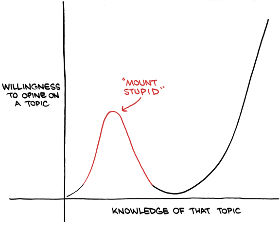

<https://psu-psychology.github.io/psy-525-reproducible-research-2020/how_to/make-website-with-rstudio.html>

# Preliminaries

## What is the purpose of this guide?

To give you a basic understanding of how data is stored in a computer, how to compute summary statistics, and basic regressions. Since this is a **super** basic guide, assume an asterisk after almost every line.

## How it's structured

Before we get to actual coding, it's useful to go over some general principles about coding and debugging.  If you only care about the actual coding skip to the section called [An Intro to R Studio].  

## Install R and R Studio

1) Install R <https://cran.r-project.org/>.  MAKE SURE YOU INSTALL THE CORRECT VERSION
- To tell the type of Mac you have, go to the apple icon in the top left of the screen and click "About This Mac"
- For an M1 Mac <https://cran.r-project.org/bin/macosx/big-sur-arm64/base/R-4.2.0-arm64.pkg>
- For an intel based mac <https://cran.r-project.org/bin/macosx/base/R-4.2.0.pkg>
- For Windows <https://cran.r-project.org/bin/windows/base/>
- For Linuix <https://cran.r-project.org/bin/linux/>

Then R Studio <https://www.rstudio.com/products/rstudio/download> which is a integrated development environment for R. "It includes a console, syntax-highlighting editor that supports direct code execution, as well as tools for plotting, history, debugging and workspace management (R Stuido 2022)."

If you have a mac you probably also need to install XQuartz <https://www.xquartz.org/>, Xcode <https://apps.apple.com/us/app/xcode/id497799835?mt=12>, and install command line developer tools from within Xcode.  When you open Xcode for the first time there will be an option to do this.  If not, in the terminal type:

xcode-select --install 

## What is R?

It's a program that allows users to analyze data, write academic papers, create websites, build applications, and tons of other stuff.  I

## Some Principles of Coding that I use

1)  Organize your files!
2)  See 1
3)  Know what you're doing before you do it
4)  If you don't put comments in your code you will have no idea how it works when you come back to it
5)  Simple is better - unless you have to optimize something, don't spend hours making something slick and fast
6)  Don't waste time solving a future problem (i.e. don't make something generic if you don't have to)
7)  If you have to do something multiple times, write a function or a loop
8)  Check every line of code to make sure it works AND it gives you the expected output. This applies doubly to merging data
9)  When you ignore 8 you will be unhappy.  The [Beware of Mount Stupid](next section) will give you an approximate idea of when you'll ignore coding principles.   

If you take away nothing else from this seminar please organize your files and comment your code.

## Beware of Mount Stupid 


## Coding is difficult

Computers are fast. But they can only do *exactly* what you tell them. This means that small errors (such as typos) can cause errors as a computer doesn't know that you meant to type "mean" when you typed "mena".

## What do I do if I have a problem/error?

When you code you will have errors. If you email me every time you get an error both you and I will be very unhappy. I've been coding for over a decade and I still make errors almost every time I code. The main difference between me now and me in 2008 (when I ran my first regressions) is that I'm better at debugging.

So, what do you do: read the error message and then Google it! Look for answers on StackOverlfow. Be suspicious of answers that have sudo in them. That stands for "SuperUser do" and can modify restricted files on your computer. Basically, you risk really screwing up your computer.  Sometimes you need to use sudo, but be sure that you really need to.

For most applications, the data analysis you're doing is extremely common. This means that you are *very* unlikely to have a problem nobody else has ever had before. 

## Wait - I want the previous section in list form

Here are steps you can use to resolve an error

1) Read the error.  Like read the whole thing.  It may be red and scary looking but the only way you can begin to get a handle on the error is if you read the whole thing. 

2) In the beginning you will get a lot of errors because your data is incompatable with what you want to do with it.  For example, you're taking the mean of vector of characters.  Or you have the wrong file path.  Or you forgot to set stringsasfactors to False.  

3) Copy the technical sounding part into Google and search for answers on Stack Overflow 

4) If Stack Overflow fails 1 of 2 things is happening: 1) your problem is unique and unknown^[If this is the case, you're likely in for a bad time if you need to solve this error] or 2) You weren't googling the right part of the error.  You can try to find answers on other websites like github, reddit, or someone's personal site.  

...

6) Read the R help files. They can be dense and often difficult to read.  My personal philosophy is to use them as a last resort.  

Exer

## What if I have a mac that runs on an M1 chip and need to do something with Java?

First, see if you can do whatever you want to do without using Java.

Second, if it's inevitable 1) I'm sorry and 2) what works currently may not work in a few months.  The current solution to the problem is here in section 6.3.2. <https://cran.r-project.org/doc/manuals/r-patched/R-admin.html#macOS-packages>

## What if I'm doing something that involves Fortran or C++

See [Wait - I want the previous section in list form](the prior list).  Also good luck.

## I don't understand how x works 

1) Look for vignettes - these are R documents that show how packages work
  - e.g., <https://cran.r-project.org/web/packages/dplyr/vignettes/dplyr.html>
2) Use the code from the vignette on the fake data 
3) With a pencil and paper, compare the variables from the fake data to your data

## I already hate this guide, give me a better one

There are a million guides to R/stats Here are some of my favorites:

-   <https://rafalab.github.io/dsbook/getting-started.html>
-   <https://egap.org/resource/10-things-to-know-about-reading-a-regression-table/>\
-   <https://stats.idre.ucla.edu/stata/output/regression-analysis/>
-   *Mastering Metrics* and *Mostly Harmless Econometrics* by Angrist and Pische
    -   The "Mostly" in "Mostly Harmless" is a lie but it's an amazing book

# An Intro to R Studio


## installing packages


## Finally, some code!
```{r setup, include=T}

# Comments come after pound signs, the computer won't run this code at all
#' To have comments go over many lines, start the first line with a pound sign and then an apostrophe
#' Like this 

# These lines install packages that you're probably going to use below
knitr::opts_chunk$set(echo = TRUE)
packages <- c("ggplot2", "dplyr","tidyverse","skimr", "haven", "magrittr", "kableExtra")
install.packages(setdiff(packages, rownames(installed.packages())),repos = "http://cran.us.r-project.org")  

library(ggplot2)
library(tidyverse)
library(skimr)
library(haven)
library(kableExtra)
```

## Exercise 1
Install the packages tidylog, magrittr, stringr, and tidyr

## A Few Basic Commands

**$** - allows you to select a variable

## The Tidyverse

This is a group of packages that use a common grammar - i.e. you can do many things using the same components.  In general, it's very fast and very good (except when its not).


# A Super Brief Guide to Data

## What is data?

At the most basic level, data is a piece of information about something. For our purposes, data can be viewed as a numerical representation of some phenomenon. For example, the heights of NBA players, the GDP of OPEC countries from 1999-2015, etc...

## Where do I find it?

Mostly online. Sometimes you'll create it yourself (like in a Bio/Chem lab) but, in the social sciences unless you're running experiments you're likely finding the majority of your data online.

## Is it ready to use out of the box?

Unlikely.

## How is it stored?

There are a variety of formats - the most common are CSV (comma separated values), xls/xlsx (Excel spreadsheets), .dta (STATA), .tab (tab delimited), and sqlite/sql (databases). You always want to pay attention to the file ending as different endings require different strategies to load the data. The most basic forms, spreadsheets (csv/xls/xlsx) can be opened in a program like Excel/Google Sheets/Numbers.

## How do I find the filepath?

You need to tell a computer exactly where a file is located otherwise it can't find the file.

A filepath is where data is stored. In a mac, right click (or two fingered click on a track pad) then hold down the option key and click the option "copy [filename] as Pathname". On a PC it's "copy as path".

## What is the first thing I do when I download data?

Read the codebook. Here is one codebook for a dataset that comes with R: <https://stat.ethz.ch/R-manual/R-devel/library/datasets/html/mtcars.html>

## What if there is no codebook?

That happens sometimes, it's annoying. Information should be stored in the variables themselves or in the paper you got the data from.

## Unit of Analysis

The second thing you do after reading the codebook is to figure out what each row of the data represents. Is is a person? Country? Country-year? The subject of each row is the "unit of analysis" i.e. what you're analyzing.

## What does data look like?

This is a sample from a dataset called mtcars that is included in R.

```{r}
knitr::kable(mtcars, digits = 2) %>%
  kable_styling(bootstrap_options = c("striped", "hover"))  %>%
  scroll_box(width = "900px", height = "200px")
```

## Know how your data is stored

You can't take averages of non-numeric data. So make sure your data is stored as a number or, if not, you convert it to one.

```{r}
# see if data is numeric or not.  If not, will need to convert
lapply(X = mtcars, FUN = class)
```

## Summary Statistics

Once you have data you need to describe it. Below are some useful summary statistics.

n is the number of observations. We care about this because we want to know how much data we're dealing with. If some variables have more information than others, this helps us figure out where the variables are missing

min/max are good for looking for outliers. One definition of outlier is the third quantile (75th percentile) + 3 times the range from the 25-75th quantiles (for low outliers replace 3rd with first and the plus with a minus)

quantiles give you a sense of how the data is distributed. There are no hard and fast rules about good (or 'bad') distributions of data but, you should look out for things that are strange.

standard deviation is a measure of how a variable is spread. The formula is $\sigma = \sqrt{\sum{(x_i-\mu)^2}/n}$. If your data is all the same number, the standard deviation will be 0 (and you should find new data).

```{r Summary stats}
mtcars %>% 
  summarise(
            n = n(),
            min = min(mpg),
            Q1 = quantile(mpg, 0.25, na.rm = T),
            median = quantile(mpg, 0.5, na.rm = T),
            Q3 = fivenum(mpg)[4],
            Q75 = quantile(mpg, 0.75, na.rm = T),
            Q99 = quantile(mpg, 0.99, na.rm = T),
            max = max(mpg),
            sd = sd(mpg)) %>%
  kable(digits = 2) %>%
  kable_styling(bootstrap_options = c("striped", "hover"))  %>%
  scroll_box(width = "900px", height = "200px")

```

Skim is a great package for summarizing variables.

```{r code for summarizing multiple variables}
mtcars %>%
  select(mpg, cyl, disp) %>%
  skimr::skim()
```

Another great trick is to do histograms of all your variables

```{r}
mtcars %>%
  gather("variable", "value") %>%
  ggplot(aes(value)) +
  facet_wrap(~ variable, scales = "free") +
  geom_histogram() +
  theme_minimal()
```

You can also do density plots

```{r}
mtcars %>%  
  keep(is.numeric) %>%                     # Keep only numeric columns
  gather() %>%                             # Convert to key-value pairs
  ggplot(aes(value)) +                     # Plot the values
    facet_wrap(~ key, scales = "free") +   # In separate panels
    geom_density()  +# as density
    theme_minimal() 
```

## Exercise

Take a data set, figure out how the variables are stored, and give me the median, mean, standard deviation, and 95th percentile of hlth. hlth is the processed version of health. To see the difference between the two, just swap them out in the exercise below and you'll notice a difference.

Download the data from <http://www.masteringmetrics.com/wp-content/uploads/2021/04/Data.zip>. Load it using haven::read_dta("INSERT FILE PATH HERE")\
\
\
\
\
\
\
\
\
\
\
\
\
\
\
\
\
\
\
\
\
\
\

```{r exercise answer}
NHIS <- haven::read_dta("/Users/stevenrashin/Dropbox/Salem Center/Teaching/Signature Class/Data/NHIS2009_clean.dta")

# see if data is numeric or not.  If not, will need to convert
lapply(X = NHIS, FUN = class)

NHIS %>%
  summarise(
    mean = mean(hlth),
    median = quantile(hlth, 0.5, na.rm = T),
    Q95 = quantile(hlth, 0.95, na.rm = T),
    sd = sd(hlth)) 
```

## P-values

From the American Statistical Association: \`\`Informally, a p-value is the probability under a specified statistical model that a statistical summary of the data (e.g., the sample mean difference between two compared groups) would be equal to or more extreme than its observed value." See <https://www.tandfonline.com/doi/full/10.1080/00031305.2016.1154108> for more details.

Why do we use them?

We use them to see if the statistics we compute (coefficients/means/etc...) are different from 0. In the social sciences we typically use a threshold of 0.05. That means that there is, at most, a 5% chance that the null hypothesis (that there is no effect) cannot be disproved. This is a big deal - a non-significant regression coefficient (i.e. p\>0.05) can sink a research paper/dissertation/policy.

What are some guidelines for interpreting p-values?

\`\`1) P-values can indicate how incompatible the data are with a specified statistical model.\
2) P-values do not measure the probability that the studied hypothesis is true, or the probability that the data were produced by random chance alone.\
3) Scientific conclusions and business or policy decisions should not be based only on whether a p-value passes a specific threshold.\
4) Proper inference requires full reporting and transparency.\
5) A p-value, or statistical significance, does not measure the size of an effect or the importance of a result.\
6) By itself, a p-value does not provide a good measure of evidence regarding a model or hypothesis (ASA 2016)."

How do we use them?

If p\<0.05, we can reject the null hypothesis that there is no effect.

How do we calculate them?

In general, statistical programs do it for you. See the example below:

```{r}
# generate random data
a <- rnorm(n = 100, mean = 5, sd = 4)
b <- rnorm(n = 50, mean = 10, sd = 3)
# now put data into same dataset so that we can easily plot them together
data_together <-tibble(data = c(a,b),
       group = c(rep("A",100),rep("B",50))
)

ggplot(data_together, aes(x=data, color=group)) +
  geom_histogram(fill="white", position="dodge",binwidth = 5) +
  theme_minimal() +
  geom_vline(xintercept = mean(a), linetype="dotted") +
  geom_vline(xintercept = mean(b), linetype="dashed") +
  ggtitle("Comparison of Two Normal Distributions") +
  xlab("Data Value") + ylab("Count") 


t.test(a,b)
```

## How do I interpret a regression coefficent?

This section is also out of order. But, since repetition is key to learning, I'm going to tell you how to do this at the beginning and the end of this guide. Go to page 10 of <http://www.masteringmetrics.com/wp-content/uploads/2020/07/lny20n07MRU_R1.pdf>.

## Regression Basics

Angrist (as in Nobel Lauriate Josh Angrist) and Pischke write: "I like to define the regression of $Y_i$ on a vector of covariates, $X_i$, as the best linear predictor (BLP) of $Y_i$ given $X_i$. This regression origin story gives no quarter to the question of why we're running it. (<http://www.masteringmetrics.com/wp-content/uploads/2020/07/lny20n06MRU_R3-1.pdf>)"

In other words, linear regression models the linear relationship between a dependent variable and one or more independent variables. A dependent variable is what you want to explain. Independent variables explain the dependent variable. Linear regression allows us to quantify a relationship between a dependent and independent variable while controlling for other factors. For example, they can tell us the impact of attending a private school on earnings (you'll be happy to know that there is no effect) while controlling for things like parental income, race, and being an athlete (see Mastering Metrics, page 63).

One important concept above is that regression is the best **linear** predictor. The data may not be linear. If it isn't, a standard technique is to try to make it more linear by doing things like logging a variable.

Think of regression as a fancy way of drawing a line (with one predictor), a plane (with 2), or a hyperplane (with n predictors).

The formula for a regression with two independent variables is the following:

$${Y_i} = {\alpha} + {\beta}X_{1i} + {\gamma X_{2i}} + \epsilon_i $$ To estimate this equation we're going to tell a computer to minimize the sum of the squared residuals (that's minimizing the following quantity $\epsilon_i = Y_i - \hat{Y_i} = Y_i - ({\alpha} + {\beta}X_{1i} + {\gamma X_{2i}})$ - the hats means the quantities are estimated, non hats are the true values). A computer does this relatively quickly.

## Garbage in Garbage out

If your data sucks, no amount of fancy (or non-fancy) regressions can save it.

## Is my regression causal?

Likely not. This is too technical a discussion for this brief guide.

## Correlation is Not Causation

Nick Cage movies and drownings are highly correlated. So are the divorce rate in Maine and US margarine consumption. Murders by steam, vapor and hot objects and the age of Miss America are also correlated. See, e.g., <http://www.tylervigen.com/spurious-correlations>.

What does this mean? It means that the mechanics of regression work *whether or not the output makes sense.* So it's up to you to tell us why you did the analysis.

## Interpreting Regression Coefficients

See <https://stats.idre.ucla.edu/other/mult-pkg/faq/general/faqhow-do-i-interpret-a-regression-model-when-some-variables-are-log-transformed/> for a fuller guide.

A regression coefficient tells us how changing the independent variable x by one unit changes the dependent variable y. The constant is the baseline value of y given to all the x's. It may not make any sense. While we may sometimes be interested in the constant, we're almost always interested in doing a hypothesis test to see if the independent variable has a statistically significant effect on the dependent variable (i.e. the null hypothesis is that ${\beta}=0$ and the alternative hypothesis is that ${\beta}\neq0$).

Using ordinary least squares, this list gives you a guide for interpreting regression coefficients:

-   No logged dependent (DVs) or independent variables (IVs) (e.g., ${y_i}={\alpha}+{\beta}x_i$)
    -   A one unit increase in the IV results in a \_ increase in the DV
    -   A slightly more sophisticated way of doing it is a one standard deviation increase in the IV results in a \_ increase in the DV
-   A logged dependent variable, unlogged independent variable (e.g., ${ln(y_i)}={\alpha}+{\beta}x_i$)
    -   Interpret as a percentage in the following way: Take the ${\beta}$ and make it the exponent of e. So $e^{{\beta}} = ?$. You can do this in R with the command "exp(${\beta}$)". Suppose $e^{{\beta}} = 1.12$ then you can say that a one unit increase in the IV increases the DV by 12%
-   Unlogged DV, logged IV (e.g., ${y_i}={\alpha}+{\beta}ln(x_i)$)
    -   Interpreted as an x (in this example 10) percent increase in the independent variable increases the dependent variable by \_ units. Units measured as the DV is measured.
    -   $e^{1.1}*\beta$ - A 10% increase in IV increases DV by \_ units
-   Logged DV & IV (e.g., ${ln(y_i)}={\alpha}+{\beta}ln(x_i)$)
    -   Interpret as a x% increase in the independent variable increases the dependent variable by \_%
    -   $1.1^{{\beta}}$

## Your turn

Using the 2009 NHIS (National Health Information Survey) data from above, run a bivariate regression that looks at the effect of being uninsured on health:

```{r}
# process the data to make sure it's suitable for regression
NHIS_mod <- NHIS %>% 
  as_tibble() %>%  
  select(educ, uninsured, age, hlth, sex) %>%
  mutate(hlth = as.numeric(hlth),
    educ = as.numeric(educ),
    uninsured = as.numeric(uninsured),
         uninsured = uninsured - 1, #
         age = as.numeric(age),
    sex = sex - 1) # so 1 is female 0 is male

summary(lm(data = NHIS_mod,formula = hlth ~ uninsured))
```

Now add education, age, and sex and change "eval=FALSE" to "eval=TRUE"

```{r,eval=FALSE}
summary(lm(data = NHIS_mod,formula = hlth ~ uninsured )) # ADD STUFF TO THIS LINE
```

## Appendix: Why the central limit theorem is cool

Recall that the central limit theorem says that if a sample size is sufficiently large (usually \> 30 but no hard guidelines), then the sampling distribution (the distribution of a statistic such as a mean) will be approximately normal.

```{r CLT}
distribution <- as.numeric(rbernoulli(n = 1000,p = 0.5))#rexp(n = 1000,rate = 5)
hist(distribution,main = "Histogram of Distribtion Means",xlab = "Values")
list_of_means <- list()
for(i in 1:1000){
  list_of_means[[i]] <- mean(sample(x = distribution,size = 100,replace = T))
}
hist(unlist(list_of_means),main = "Histogram of Sample Means",xlab = "Values")
par(mfrow=c(1,2))    # set the plotting area into a 1*2 array
hist(distribution,main = "Histogram of Distribtion Means",xlab = "Values")
hist(unlist(list_of_means),main = "Histogram of Sample Means",xlab = "Values")
par(mfrow=c(1,1))    # set the plotting area into a 1*1 array
```
